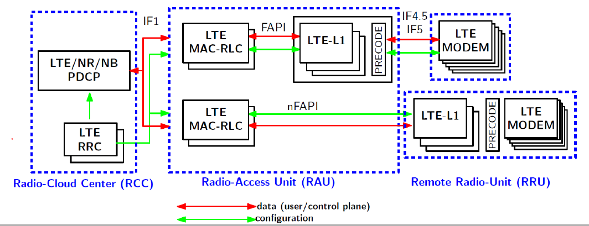

# RELEASE NOTES: #

## [v1.2.2](https://gitlab.eurecom.fr/oai/openairinterface5g/-/tags/v1.2.2) -> August 2020. ##

* Bug fix for supporting multi-antennas in RF simulator

## [v1.2.1](https://gitlab.eurecom.fr/oai/openairinterface5g/-/tags/v1.2.1) -> February 2020. ##

* Bug fix for mutex lock for wake-up signal

## [v1.2.0](https://gitlab.eurecom.fr/oai/openairinterface5g/-/tags/v1.2.0) -> January 2020. ##

This version adds the following implemented features:

* LTE-M : eNB support for Mode A repetitions
  - PUSCH CE - 8 Repetitions
* Improved CDRX implementation for monolithic eNB
* Experimental eMBMS support (now also on eNB side)
* Experimental MCE - Multicast Coordination Entity
* Bug fixes

This version also has an improved code quality:

* Better Test Coverage in Continuous Integration:
  - Initial framework to do long-run testing at R2LAB

## [v1.1.1](https://gitlab.eurecom.fr/oai/openairinterface5g/-/tags/v1.1.1) -> November 2019. ##

- Bug fix in the TDD Fair Round-Robin scheduler

## [v1.1.0](https://gitlab.eurecom.fr/oai/openairinterface5g/-/tags/v1.1.0) -> July 2019. ##

This version adds the following implemented features:

* Experimental support of LTE-M
  - Single LTE-M UE attachment, legacy-LTE UE attachment is disabled
* X2 interface and handover (also X2-U interface)
  - In FDD and TDD
* CU/DU split (F1 interface)
  - Tested only in FDD
* CDRX
  - Tested only in FDD
* Experimental eMBMS support (only on UE side)
* Experimental multi-RRU support
  - Tested only in TDD

This version has an improved code quality:

* Simplification of the Build System
  - A single build includes all full-stack simulators, S1/noS1 modes and one HW platform (such as USRP, BladeRF, ...)
* TUN interface is now used as default for the data plane
  - for UE, eNB-noS1 and UE-noS1
* Code Cleanup
* Better Static Code Analysis:
  - Limited number of errors in cppcheck
  - Important Decrease on high Impact errors in CoverityScan
* Better Test Coverage in Continuous Integration:
  - TM2, CDRX, IF4.5, F1
  - OAI UE is tested in S1 and noS1 modes with USRP board
  - Multi-RRU TDD mode
  - X2 Handover in FDD mode

## [v1.0.3](https://gitlab.eurecom.fr/oai/openairinterface5g/-/tags/v1.0.3) -> June 2019. ##

- Bug fix for LimeSuite v19.04.0 API

## [v1.0.2](https://gitlab.eurecom.fr/oai/openairinterface5g/-/tags/v1.0.2) -> February 2019. ##

- Full OAI support for 3.13.1 UHD

## [v1.0.1](https://gitlab.eurecom.fr/oai/openairinterface5g/-/tags/v1.0.1) -> February 2019. ##

- Bug fix for the UE L1 simulator.

## [v1.0.0](https://gitlab.eurecom.fr/oai/openairinterface5g/-/tags/v1.0.0) -> January 2019. ##

This version first implements the architectural split described in the following picture.

* Only FAPI, nFAPI and IF4.5 interfaces are implemented.
* Repository tree structure prepares future integrations of features such as LTE-M, nbIOT or 5G-NR.
* Preliminary X2 support has been implemented.
* S1-flex has been introduced.
* New tools: config library, telnet server, ...
* A lot of bugfixes and a proper automated Continuous Integration process validates contributions.

Old Releases:

* v0.6.1 -> Mostly bugfixes. This is the last version without NFAPI.
* v0.6 -> RRH functionality, UE greatly improved, better TDD support, a lot of bugs fixed.
  - WARNING: oaisim in PHY abstraction mode does not work, you need to use v0.5.2 for that.
* v0.5.2 -> Last version with old code for oaisim (abstraction mode works)
* v0.5.1 -> Merge of bugfix-137-uplink-fixes. It includes stablity fixes for eNB
* v0.5 -> Merge of enhancement-10-harmony-lts. It includes fixes for Ubuntu 16.04 support
* v0.4 -> Merge of feature-131-new-license. It closes issue#131 and changes the license to OAI Public License V1.0
* v0.3 -> Last stable commit on develop branch before the merge of feature-131-new-license. This is the last commit with GPL License
* v0.2 -> Merge of enhancement-10-harmony to include NGFI RRH + New Interface for RF/BBU
* v0.1 -> Last stable commit on develop branch before enhancement-10-harmony

